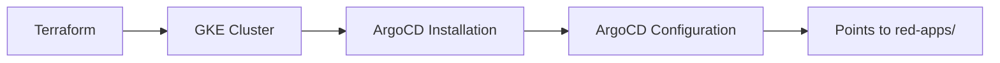
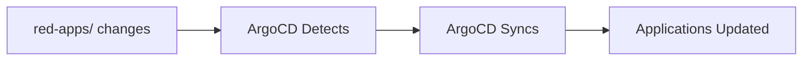

# Complete Multi-Repository GitOps Setup Guide

This guide explains the complete multi-repository GitOps architecture with separated infrastructure and applications.

## 🎯 Architecture Overview

```
red-infrastructure-gitops/
├── red-infra/                    # Infrastructure & ArgoCD Setup
│   ├── terraform/               # GKE cluster provisioning
│   ├── argocd-bootstrap/        # ArgoCD installation & config
│   └── scripts/                 # Automation scripts
└── red-apps/                    # Applications managed by ArgoCD
    ├── applications/            # ArgoCD Application definitions
    ├── helm-charts/            # Helm chart configurations
    ├── environments/           # Environment-specific values
    └── k8s-manifests/         # Additional Kubernetes resources
```

## 🏗️ How It Works

### Phase 1: Infrastructure Setup (red-infra/)


### Phase 2: Application Management (red-apps/)


## 📁 Detailed File Structure & Purpose

### red-infra/ Directory

#### Terraform Files (`red-infra/terraform/`)

**`main.tf`** - The orchestrator
```hcl
# Purpose: Coordinates all infrastructure modules
# What it does:
# - Creates VPC network via network module
# - Sets up IAM and Workload Identity via iam module  
# - Provisions GKE cluster via gke module
# - Ensures proper dependency order
```

**`variables.tf`** - Configuration parameters
```hcl
# Purpose: Defines all configurable values
# What it contains:
# - Project ID, region, cluster name
# - Network CIDR ranges
# - GitHub repositories for Workload Identity
# - Service account configurations
```

**`outputs.tf`** - Export important values
```hcl
# Purpose: Makes important values available after deployment
# What it exports:
# - Cluster connection information
# - Network details
# - Service account emails
# - kubectl configuration commands
```

**`terraform.tfvars.example`** - Configuration template
```hcl
# Purpose: Template for actual configuration
# Usage: Copy to terraform.tfvars and customize
# Contains: All required variable values with examples
```

#### Terraform Modules (`red-infra/terraform/modules/`)

**`modules/network/`** - VPC and networking
```hcl
# Purpose: Creates isolated network for the cluster
# Creates:
# - Custom VPC network
# - Subnet with private Google access
# - Secondary IP ranges for pods and services
# - Optional: Cloud Router and NAT for internet access
```

**`modules/iam/`** - Identity and access management
```hcl
# Purpose: Sets up secure authentication
# Creates:
# - Workload Identity Pool for GitHub Actions
# - Service account with minimal required permissions
# - IAM bindings for secure access
# - GitHub repository access controls
```

**`modules/gke/`** - Kubernetes cluster
```hcl
# Purpose: Provisions the actual Kubernetes cluster
# Creates:
# - GKE Autopilot cluster (fully managed)
# - Workload Identity integration
# - Network configuration
# - Security settings
```

#### ArgoCD Bootstrap (`red-infra/argocd-bootstrap/`)

**`install.yaml`** - ArgoCD installation configuration
```yaml
# Purpose: Customizes ArgoCD installation
# Configures:
# - Repository access (points to this repo)
# - Helm repository references
# - Basic ArgoCD settings
# - Namespace creation
```

**`rbac.yaml`** - Role-based access control
```yaml
# Purpose: Defines who can do what in ArgoCD
# Creates:
# - Admin role (full access)
# - Developer role (limited access)
# - ReadOnly role (view only)
# - User assignments
```

**`projects.yaml`** - ArgoCD project organization
```yaml
# Purpose: Organizes applications into logical groups
# Creates:
# - Infrastructure project (for platform components)
# - Applications project (for business apps)
# - Resource whitelists and restrictions
# - Source repository permissions
```

**`root-app.yaml`** - The "App of Apps"
```yaml
# Purpose: The master application that manages all others
# Points to: red-apps/applications/ directory
# Enables: Automatic discovery of new applications
# Configures: Auto-sync and self-healing
```

#### Scripts (`red-infra/scripts/`)

**`bootstrap-argocd.sh`** - ArgoCD installation automation
```bash
# Purpose: Automates the complete ArgoCD setup
# Steps:
# 1. Verifies cluster access and permissions
# 2. Installs ArgoCD using official manifests
# 3. Applies custom configuration
# 4. Waits for ArgoCD to be ready
# 5. Deploys the root application
# 6. Provides access information
```

### red-apps/ Directory

#### Application Definitions (`red-apps/applications/`)

**`traefik.yaml`** - Traefik load balancer
```yaml
# Purpose: Tells ArgoCD how to deploy Traefik
# Points to: red-apps/helm-charts/traefik/
# Uses: Base values + production overrides
# Creates: Load balancer with SSL termination
```

**`vault.yaml`** - HashiCorp Vault
```yaml
# Purpose: Tells ArgoCD how to deploy Vault
# Points to: red-apps/helm-charts/vault/
# Uses: Base values + production overrides
# Creates: Secrets management system
```

**`kube-prometheus-stack.yaml`** - Monitoring stack
```yaml
# Purpose: Tells ArgoCD how to deploy monitoring
# Points to: red-apps/helm-charts/kube-prometheus-stack/
# Uses: Base values + production overrides
# Creates: Prometheus, Grafana, Alertmanager
```

**`keda.yaml`** - Event-driven autoscaling
```yaml
# Purpose: Tells ArgoCD how to deploy KEDA
# Points to: red-apps/helm-charts/keda/
# Uses: Base values + production overrides
# Creates: Event-driven autoscaling system
```

#### Helm Chart Configurations (`red-apps/helm-charts/`)

Each application has its own directory with:

**`Chart.yaml`** - Chart metadata
```yaml
# Purpose: Defines which official Helm chart to use
# Specifies: Chart name, version, repository
# Example: Uses official Traefik chart v36.3.0
```

**`values.yaml`** - Base configuration
```yaml
# Purpose: Default configuration for all environments
# Contains: Resource limits, security settings, basic config
# Optimized for: GKE Autopilot compatibility
```

#### Environment Overrides (`red-apps/environments/`)

**`prod/`** - Production-specific values
```yaml
# Purpose: Production-specific overrides
# Contains: Higher resource limits, security hardening
# Examples: Larger storage, production domains, secure settings
```

**`dev/` and `staging/`** - Other environments
```yaml
# Purpose: Environment-specific customizations
# Contains: Smaller resources, debug settings, test domains
# Usage: Override base values for specific environments
```

#### Additional Resources (`red-apps/k8s-manifests/`)

**`ingress-routes.yaml`** - Traefik ingress configuration
```yaml
# Purpose: Defines how to access services via domains
# Creates: HTTPS routes with automatic SSL certificates
# Configures: Domain-based routing to services
```

## 🚀 Complete Setup Process

### Step 1: Complete Infrastructure Deployment

```bash
# Navigate to infrastructure directory
cd red-infra/terraform

# Configure your environment
cp terraform.tfvars.example terraform.tfvars
# Edit terraform.tfvars with your values

# Deploy everything (infrastructure + ArgoCD) in one command!
terraform init
terraform plan
terraform apply

# Configure kubectl
gcloud container clusters get-credentials <cluster-name> --region <region>

# Verify ArgoCD is running
kubectl get pods -n argocd
kubectl get applications -n argocd
```

### Step 3: Application Configuration

```bash
# Navigate to applications directory
cd ../red-apps

# Update repository URLs in application files
# Replace "infra-red-org/red-infrastructure-gitops" with your actual repo

# Update domain names in environment files
# Replace "yourdomain.com" with your actual domain
```

### Step 4: Verification

```bash
# Check ArgoCD applications
kubectl get applications -n argocd

# Access ArgoCD UI
kubectl port-forward svc/argocd-server -n argocd 8080:443
# Visit: https://localhost:8080

# Monitor application deployment
watch kubectl get pods -A
```

## 🔄 Daily Workflow

### Infrastructure Changes (Rare)
```bash
# Make changes to red-infra/terraform/
vim red-infra/terraform/main.tf

# Apply changes
cd red-infra/terraform
terraform plan
terraform apply

# Update ArgoCD if needed
cd ..
./scripts/bootstrap-argocd.sh
```

### Application Changes (Frequent)
```bash
# Make changes to red-apps/
vim red-apps/helm-charts/traefik/values.yaml

# Commit and push (if using Git)
git add .
git commit -m "Update Traefik configuration"
git push

# ArgoCD automatically detects and applies changes!
# No manual deployment needed!
```

## 🎯 Key Benefits

### 1. Clear Separation of Concerns
- **Infrastructure team** manages `red-infra/`
- **Application teams** manage `red-apps/`
- **No conflicts** between infrastructure and application changes

### 2. GitOps Principles
- **Git is source of truth** for everything
- **Automatic deployments** when changes are pushed
- **Complete audit trail** of all changes
- **Easy rollbacks** to previous versions

### 3. Scalability
- **Add new applications** by creating new files in `red-apps/applications/`
- **Multiple environments** supported via `red-apps/environments/`
- **Team autonomy** with separate repositories

### 4. Security
- **Workload Identity** for secure authentication
- **RBAC** for fine-grained access control
- **Secrets management** via Vault
- **Network policies** for pod isolation

## 🆘 Troubleshooting

### Infrastructure Issues
```bash
# Check Terraform state
cd red-infra/terraform
terraform show

# Check cluster status
kubectl cluster-info
kubectl get nodes
```

### ArgoCD Issues
```bash
# Check ArgoCD pods
kubectl get pods -n argocd

# Check ArgoCD logs
kubectl logs -n argocd deployment/argocd-application-controller

# Access ArgoCD UI
kubectl port-forward svc/argocd-server -n argocd 8080:443
```

### Application Issues
```bash
# Check application status
kubectl get applications -n argocd

# Check specific application
kubectl describe application traefik -n argocd

# Check application pods
kubectl get pods -n traefik-v2
```

## 🔧 Customization

### Adding New Applications
1. Create application definition in `red-apps/applications/`
2. Create Helm chart configuration in `red-apps/helm-charts/`
3. Add environment-specific values in `red-apps/environments/`
4. ArgoCD automatically deploys the new application

### Environment Management
1. Create new environment directory in `red-apps/environments/`
2. Add environment-specific value files
3. Update application definitions to reference new environment
4. Deploy to new environment

### Security Hardening
1. Update RBAC policies in `red-infra/argocd-bootstrap/rbac.yaml`
2. Enable private cluster in `red-infra/terraform/modules/gke/main.tf`
3. Add network policies in `red-apps/k8s-manifests/`
4. Configure Vault for production in `red-apps/environments/prod/`

This architecture provides a production-ready, scalable GitOps setup that follows industry best practices!